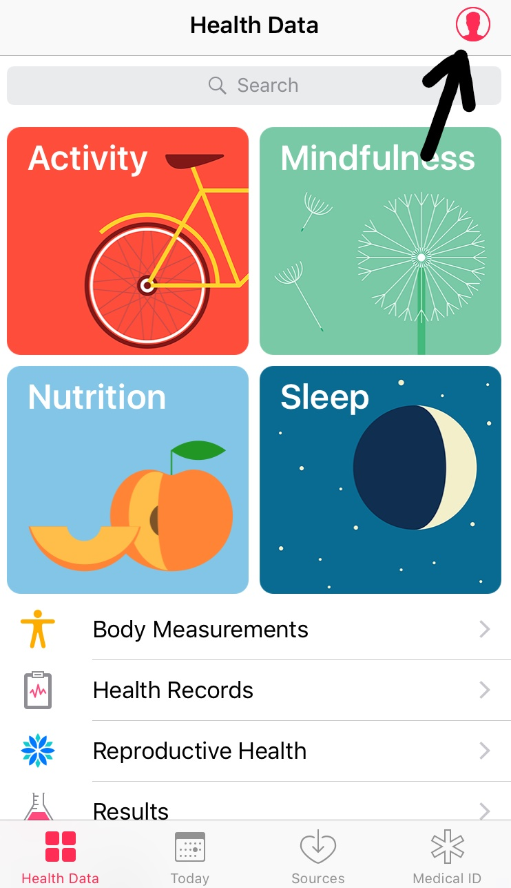
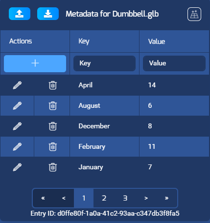
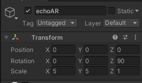
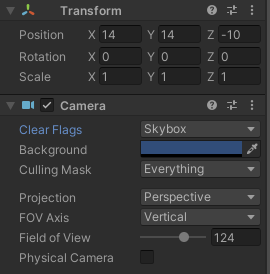
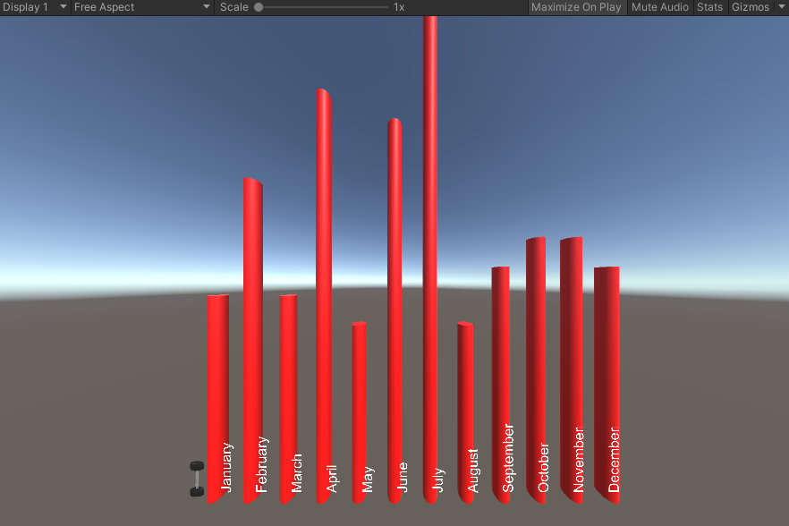

# Apple-Health-Data-echoAR-Visual-
Visualizing one year of Apple's iOS Health App Data with echoAR, Unity, Python

## My Setup
- Exported Health Data from Apple iPhone
- Extracted only records about Step Count
- Find the mean number of steps for each month in 2019
- Create a dataframe and convert to csv
- Create new Unity project
- Install echoAR Unity SDK
- Added the dumbbell model 
- Connected echoAR API key in Unity
- Added the csv metadata into the model
- Used echoAR/CustomBehaviour.cs script from echoAR COVID tutorial
- Set up camera position and echoAR transformation
- Run Unity program: play button

## Screenshots

## Big Thanks
- echoAR for use of platform and references to tutorial 
  https://github.com/echoARxyz/Unity-echoAR-demo-COVID19#register
- Analyze Your iOS Health Data With Python medium article for understanding of Apple Health Structure
  https://medium.com/better-programming/analyze-your-icloud-health-data-with-pandas-dd5e963e902f

